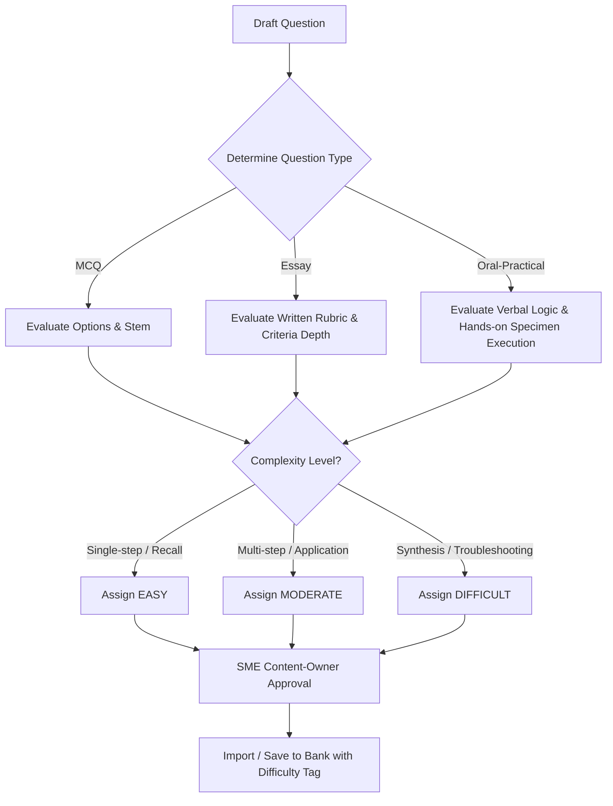

# Question Difficulty Guide: QC Competency Technical Assessment (CTA)

## 1. Overview & Purpose

The **QC Competency Technical Assessment (CTA) Portal** evaluates quality control candidates across multiple technical disciplines (Welding, NDT, Piping, Civil, Coating, Electrical, Instrumentation, Mechanical, Cathodic Protection, etc.). 

This **Question Difficulty Guide** establishes a standardized, objective framework for classifying assessment questions into three distinct difficulty levels:
- **Easy**
- **Moderate**
- **Difficult**

### Core Principles
1. **Internal Design Attribute**: Difficulty is an internal assessment-design attribute used by Admins and Reviewers to build balanced, stratified test sessions. Difficulty brackets are **never** displayed to candidates before, during, or after an assessment.
2. **Fixed Scoring Structure**: Difficulty level **does not** alter point values or create unapproved score multipliers. Question types have assigned maximum points:
   - **Multiple Choice Question (MCQ)** = 1 point max
   - **Essay Question** = 4 points max
   - **Oral-Practical Question** = 4 points max
3. **Objective Evaluation**: Difficulty is determined by cognitive complexity, required technical synthesis, and problem-solving steps—**not** by question text length, option length, or complex vocabulary alone.
4. **Discipline Owner Validation**: Every question imported or added to the question bank must be assigned a difficulty bracket approved by a qualified discipline Subject Matter Expert (SME).

---

## 2. Difficulty Classification Matrix

| Dimension | Easy | Moderate | Difficult |
| :--- | :--- | :--- | :--- |
| **Bloom's Taxonomy** | **Remembering / Understanding** | **Applying / Analyzing** | **Evaluating / Synthesizing** |
| **Cognitive Focus** | Direct recall of standard values, definitions, basic terminology, or single-step rules. | Interpretation and application of standards to standard field scenarios, multi-step calculations, procedural essays, or combined oral-practical demonstrations. | Synthesis of conflicting code requirements, complex field troubleshooting, edge-case nonconformance disposition, or advanced oral-practical defect analysis. |
| **Number of Steps** | 1 step (direct retrieval or matching). | 2–3 logical steps (parameter lookup + application + verbal explanation or physical measurement). | Multi-step evaluation (root cause analysis, trade-off analysis, regulatory conflict resolution). |
| **Code / Standard Reference** | Single explicit code clause or standard definition (e.g., ASME, API, AWS, NACE, NEC, ASTM). | Combining two clauses or interpreting tables/charts under standard conditions. | Cross-referencing multiple codes, specifications, project Quality Plans, and non-standard field conditions. |
| **Question Types Supported** | MCQ, Essay, Oral-Practical | MCQ, Essay, Oral-Practical | MCQ, Essay, Oral-Practical |
| **Point Allocation** | MCQ: 1 pt Essay: 4 pts max Oral-Practical: 4 pts max | MCQ: 1 pt Essay: 4 pts max Oral-Practical: 4 pts max | MCQ: 1 pt Essay: 4 pts max Oral-Practical: 4 pts max |

---

## 3. Classification Definitions & Criteria

### 3.1 Easy (Direct Recall & Routine Single-Step Verification)
- **Definition**: Questions testing basic technical literacy, standard terminology, essential variables, elementary safety rules, and direct pass/fail criteria.
- **Essay Characteristics**: Brief listing of basic requirements, single-part responses, or direct identification of inspection tools/documents (scored out of 4 points max).
- **Oral-Practical Characteristics**: Direct verbal responses on standard definitions/safety rules, single tool identification, or taking a single direct measurement on a reference block (scored out of 4 points max).
- **Target Assessment Ratio**: ~30% of standard assessment bank.

### 3.2 Moderate (Application & Multi-Step Field Scenarios)
- **Definition**: Questions requiring candidates to apply codes, standards, and inspection procedures to typical field quality scenarios.
- **Essay Characteristics**: 
  - Standard procedural essay prompts requiring candidates to describe a step-by-step field inspection workflow.
  - Guided by a structured multi-part rubric (e.g. 4 key inspection stages rated up to 1 point each, totaling 4 points maximum).
- **Oral-Practical Characteristics**: 
  - Combined verbal explanation and hands-on execution of a standard field inspection task (scored out of 4 points max).
  - Candidate verbally walks the reviewer through inspection steps while physically demonstrating tool selection, taking accurate measurements on a test coupon/specimen, evaluating results against code tables, and recording findings on an inspection sheet.
  - Evaluated on technical communication clarity, gauge handling precision, and correct code reference application.
- **Target Assessment Ratio**: ~50% of standard assessment bank (Default level for legacy questions).

### 3.3 Difficult (Synthesis, Judgment & Non-Routine Troubleshooting)
- **Definition**: Questions testing advanced technical judgment, root cause investigation, non-routine flaw disposition, or resolving conflicting technical requirements.
- **Essay Characteristics**: Open-ended nonconformance investigation or failure mode analysis (scored out of 4 points max).
- **Oral-Practical Characteristics**: 
  - Complex live assessment combining hands-on multi-defect specimen evaluation, root cause identification, verbal defense of findings under reviewer cross-examination, and drafting a formal Nonconformance Report (NCR) with corrective action disposition (scored out of 4 points max).
- **Target Assessment Ratio**: ~20% of standard assessment bank.

---

## 4. Question Classification Exemplars by Discipline

### 4.1 Welding QC

#### Easy
- **Type**: MCQ
- **Prompt**: Which of the following is considered an essential variable for SMAW procedure qualification under ASME Section IX?
  - A) Change in base metal P-Number *(Correct)*
  - B) Change in brand of welding machine
  - C) Minor decrease in preheat within 10°C
  - D) Change in lighting conditions
- **Classification Justification**: Tests direct recall of ASME Section IX essential variables for SMAW.

#### Moderate (MCQ)
- **Type**: MCQ
- **Prompt**: During visual inspection of a groove weld on a carbon steel pipe (P-No. 1), an inspector notes a 1.5 mm undercut. Per ASME B31.3 for Normal Fluid Service, what is the maximum allowable undercut depth?
  - A) 0.8 mm or 1/32 in
  - B) 1.5 mm or 1/16 in, provided it does not exceed 1 mm for depth > 10 mm
  - C) Lesser of 1 mm or 1/32 in *(Correct)*
  - D) Undercut is never acceptable under any condition
- **Classification Justification**: Requires looking up and applying ASME B31.3 visual acceptance criteria for a specific fluid service classification.

#### Moderate (Essay)
- **Type**: Essay (Max Points: 4)
- **Prompt**: Describe the mandatory inspection steps a Welding QC Inspector must perform before, during, and after a production pipe weld on carbon steel piping. List the key verification records to be signed.
- **Rubric**:
  - Award up to 2.5 points for Pre-weld checks: WPS/PQR availability, welder qualification (WQR), joint fit-up/bevel, cleanliness, tack weld quality, preheat.
  - Award up to 2.5 points for In-process checks: Interpass temperature, cleaning between passes, electrode storage/baking, visual appearance of root/hot pass.
  - Award up to 2.5 points for Post-weld checks: Visual inspection against acceptance criteria, NDT requisition, weld log updates, dimensional check.
  - Award up to 2.5 points for Records: Weld summary report, NDT reports, joint traceability sign-off.
- **Classification Justification**: Standard procedural application essay following a structured 4-part inspection workflow for routine welding operations.

#### Moderate (Oral-Practical)
- **Type**: Oral-Practical (Max Points: 4)
- **Prompt**: Using the provided Bridge Cam gauge and welded pipe coupon, inspect the weld joint for root/face reinforcement height and undercut. Verbally explain how you verify on-site that the welder's qualification (WQR) covers this joint, log all measurements on the inspection report sheet, and state pass/fail against ASME B31.3.
- **Rubric**:
  - Award up to 2.5 points for verbal explanation of WQR essential variable verification (P-No, F-No, thickness, position).
  - Award up to 2.5 points for selecting, zeroing, and correctly measuring reinforcement height with the Bridge Cam gauge.
  - Award up to 2.5 points for accurate measurement of undercut depth and evaluation against ASME B31.3 limits.
  - Award up to 2.5 points for completing the inspection log sheet with clear pass/fail determination.
- **Classification Justification**: Combined oral-practical evaluation pairing verbal welder verification logic with hands-on gauge inspection.

#### Difficult (Essay)
- **Type**: Essay (Max Points: 4)
- **Prompt**: Explain the primary causes of hydrogen-induced cracking (cold cracking) in carbon steel weldments. Detail three preventive measures, and outline how a QC Inspector must investigate and disposition a post-hydrotest delay crack detected on a thick-wall P-No. 5B alloy steel joint.
- **Rubric**: 
  - Award up to 3 points for identifying 3 factors: diffusible hydrogen, susceptible microstructure (martensite), residual stress.
  - Award up to 3 points for detailing mitigations: low-H2 consumables, preheat/interpass control, PWHT / de-hydrogenation heat treatment (DHT).
  - Award up to 4 points for root cause & disposition: NDT re-examination, excavation boundaries, repair WPS qualification, hydrogen baking, and engineering evaluation.
- **Classification Justification**: Synthesizes metallurgy, non-destructive testing, repair procedures, and root cause analysis in alloy steel welding.

#### Difficult (Oral-Practical)
- **Type**: Oral-Practical (Max Points: 4)
- **Prompt**: Examine the provided cracked alloy steel weld specimen. Identify the defect type, perform excavation boundary measurements, verbally defend your root cause investigation and repair WPS requirements under reviewer questioning, and complete a formal Nonconformance Report (NCR).
- **Rubric**:
  - Award up to 2.5 points for physical identification and measurement of defect boundaries.
  - Award up to 2.5 points for verbal defense of root cause factors (hydrogen, preheat deficiency, martensitic microstructure).
  - Award up to 2.5 points for proposing compliant repair WPS, preheat/DHT requirements, and re-NDT sequence.
  - Award up to 2.5 points for drafting a complete, professional Nonconformance Report (NCR).
- **Classification Justification**: Advanced oral-practical synthesis requiring hands-on examination, verbal defense, and formal quality documentation.

---

### 4.2 NDT QC (Non-Destructive Testing)

#### Easy
- **Type**: MCQ
- **Prompt**: In Radiographic Testing (RT), what artifact is placed on the film/detector side or source side to evaluate image quality and radiographic sensitivity?
  - A) Pie Gauge
  - B) IQI / Penetrameter *(Correct)*
  - C) Field Indicator
  - D) Step Wedge Calibrator
- **Classification Justification**: Direct recall of standard NDT terminology and inspection tools.

#### Moderate (MCQ)
- **Type**: MCQ
- **Prompt**: When performing Liquid Penetrant Testing (PT) using solvent-removable lipophilic penetrant, what is the mandatory minimum dwell time for detecting fine fatigue cracks at 20°C ambient temperature per ASME Section V, Article 6?
  - A) 2 minutes
  - B) 5 minutes
  - C) 10 minutes *(Correct)*
  - D) 30 minutes
- **Classification Justification**: Application of ASME Sec V table parameters based on flaw type and surface temperature.

#### Moderate (Essay)
- **Type**: Essay (Max Points: 4)
- **Prompt**: Describe the step-by-step surface preparation, application, dwell time, cleaning, and developer steps required when performing solvent-removable visible dye penetrant testing (PT) on a stainless steel weldment.
- **Classification Justification**: Standard procedural essay covering standard PT inspection protocol.

#### Moderate (Oral-Practical)
- **Type**: Oral-Practical (Max Points: 4)
- **Prompt**: Perform a magnetic particle inspection (MT) on the provided weld plate using an AC yoke and dry magnetic powder. Verbally explain your yoke calibration check and light level requirements, measure identified indications, and log findings on the MT report.
- **Rubric**:
  - Award up to 2.5 points for verbal explanation of yoke 10 lb lift test and white light intensity ($\ge 1000\,\text{lux}$).
  - Award up to 2.5 points for proper yoke placement, magnetic field application, and powder blowing technique.
  - Award up to 2.5 points for accurate detection and measurement of flaw indications.
  - Award up to 2.5 points for reporting findings and performing demagnetization/post-cleaning.
- **Classification Justification**: Combined oral-practical evaluation of magnetic particle testing execution and procedural verbalization.

---

### 4.3 Piping QC

#### Easy
- **Type**: MCQ
- **Prompt**: Per ASME B31.3, what is standard hydrostatic test pressure for metallic piping systems?
  - A) 1.1 times design pressure
  - B) 1.5 times design pressure (adjusted for allowable stress ratio) *(Correct)*
  - C) Equal to operating pressure
  - D) 2.0 times maximum allowable pressure
- **Classification Justification**: Direct recall of standard pressure test formula parameter in ASME B31.3.

#### Moderate (MCQ)
- **Type**: MCQ
- **Prompt**: During a flange alignment inspection, an inspector measures a bolt hole mismatch exceeding 3 mm and flange face parallelism out by 1.5 mm/m. What is the required QC action before torqueing?
  - A) Force alignment using drift pins and tighten bolts
  - B) Reject alignment, issue a nonconformance, and require piping stress re-evaluation or fit-up correction *(Correct)*
  - C) Apply extra gasket sealant to compensate for mismatch
  - D) Heat the pipe spool with a torch to bend it into position without record
- **Classification Justification**: Applied judgment evaluating field tolerance limits against piping code installation requirements.

#### Moderate (Oral-Practical)
- **Type**: Oral-Practical (Max Points: 4)
- **Prompt**: Inspect the provided flange joint spool for gap alignment and face finish. Verbally explain how you verify hydrotest manifold pressure gauges and relief valve calibration, set up a calibrated torque wrench, apply the torque pattern, and complete the flange sign-off sheet.
- **Rubric**:
  - Award up to 2.5 points for verbal explanation of hydrotest gauge calibration sticker verification and 2x test pressure range check.
  - Award up to 2.5 points for physical measurement of flange gap parallelism and bolt hole alignment.
  - Award up to 2.5 points for torque wrench setup, calibration verification, and applying criss-cross torqueing technique.
  - Award up to 2.5 points for completing the flange inspection report log.
- **Classification Justification**: Integrated oral-practical test combining hydrotest manifold safety verbalization with hands-on flange torqueing.

---

### 4.4 Civil QC

#### Moderate (Oral-Practical)
- **Type**: Oral-Practical (Max Points: 4)
- **Prompt**: Using a rebar cover meter (profometer), measure concrete cover depth and rebar spacing on the provided concrete block. Verbally explain the concrete delivery receiving steps and slump rejection rules, and log findings against approved structural drawings.
- **Rubric**:
  - Award up to 2.5 points for verbal explanation of concrete truck delivery checks (batch ticket, slump, air content, max drop height).
  - Award up to 2.5 points for cover meter zeroing and calibration check.
  - Award up to 2.5 points for accurate cover depth and rebar pitch measurement at 3 spots.
  - Award up to 2.5 points for structural drawing comparison and completing the inspection report.
- **Classification Justification**: Combined oral-practical civil inspection pairing fresh concrete receiving rules with non-destructive cover meter testing.

---

### 4.5 Coating QC

#### Moderate (Oral-Practical)
- **Type**: Oral-Practical (Max Points: 4)
- **Prompt**: Using a sling psychrometer and surface thermometer, determine ambient dew point and steel surface temperature. Then, use a magnetic Dry Film Thickness (DFT) gauge to perform an SSPC-PA2 DFT survey on the provided coated plate. Verbally explain if coating application can proceed and report DFT compliance.
- **Rubric**:
  - Award up to 2.5 points for psychrometer operation, dew point calculation, and verifying steel temp $\ge \text{Dew Point} + 3^\circ\text{C}$.
  - Award up to 2.5 points for magnetic DFT gauge calibration verification using smooth shims on uncoated steel.
  - Award up to 2.5 points for performing 5-spot SSPC-PA2 DFT measurement (3 readings per spot) and calculating averages.
  - Award up to 2.5 points for verbal synthesis of environmental compliance and completing the coating inspection sheet.
- **Classification Justification**: Comprehensive coating oral-practical test combining environmental measurement with SSPC-PA2 DFT testing.

---

### 4.6 Electrical QC

#### Moderate (Oral-Practical)
- **Type**: Oral-Practical (Max Points: 4)
- **Prompt**: Inspect the provided 480V motor control panel cable termination. Perform a Megger insulation resistance test on the phase conductors, verbally explain single-line diagram verification and cable glanding rules, and log test results.
- **Rubric**:
  - Award up to 2.5 points for verbal explanation of single line diagram review, cable tray fill, and glanding requirements.
  - Award up to 2.5 points for Megger instrument zeroing, lead safety setup, and applying 1000V DC test voltage.
  - Award up to 2.5 points for accurate insulation resistance reading evaluation against NETA limits ($\ge 100\,\text{M}\Omega$).
  - Award up to 2.5 points for completing the electrical test report log sheet.
- **Classification Justification**: Combined electrical oral-practical test pairing drawing/gland verbalization with hands-on insulation testing.

---

### 4.7 Instrumentation QC

#### Moderate (Oral-Practical)
- **Type**: Oral-Practical (Max Points: 4)
- **Prompt**: Perform a 5-point calibration check (0%, 25%, 50%, 75%, 100%) on the provided 4–20 mA pressure transmitter using a precision multimeter and pressure hand pump. Verbally explain HART communication setup and failed calibration escalation, and log output readings.
- **Rubric**:
  - Award up to 2.5 points for verbal explanation of HART communicator configuration, master gauge calibration certificate check, and NCR handling.
  - Award up to 2.5 points for test pump pressure application and digital multimeter connection.
  - Award up to 2.5 points for taking accurate mA output readings at 5 calibration points (4, 8, 12, 16, 20 mA).
  - Award up to 2.5 points for calculating percentage error and logging results on the calibration record sheet.
- **Classification Justification**: Practical instrumentation loop testing combined with verbal calibration governance.

---

## 5. Question Type Guidelines

### 5.1 Multiple Choice Questions (MCQs)
- **Scoring**: 1 point max.
- **Easy**: Direct question stem; 1 correct answer; 3 distractor options that are clearly distinct.
- **Moderate**: Scenario-based stem; distractor options include common calculation errors or misinterpretations of adjacent code clauses.
- **Difficult**: Multi-variable scenario stem; distractor options reflect subtle real-world trade-offs or closely related code exceptions.

### 5.2 Essay Questions
- **Scoring**: 4 points max.
- **Easy**: Single-part recall or brief written definition (scored out of 4 points max).
- **Moderate**: Describing a complete, routine inspection workflow (before, during, and after inspection), detailing acceptance criteria lookup, recording inspection evidence, and explaining standard nonconformance escalation steps (guided by a structured 4-part rubric valued up to 1 point each, totaling 4 points max).
- **Difficult**: Non-routine defect troubleshooting, root cause analysis, resolving conflicting specification requirements, or developing an emergency quality mitigation plan (scored out of 4 points max).

### 5.3 Oral-Practical Questions
- **Scoring**: 4 points max.
- **Easy**: Combined basic verbal questions (definitions, document titles, safety rules) or taking a single direct measurement on a reference block with a basic tool (4 pts max).
- **Moderate**: Combined verbal interview and physical specimen inspection. Candidate walks the reviewer through routine inspection logic while physically demonstrating tool selection, taking accurate measurements on a test coupon/specimen, evaluating findings against code tables, and recording results on an inspection sheet (4 pts max).
- **Difficult**: High-complexity combined assessment. Candidate performs hands-on multi-defect specimen evaluation, identifies root cause factors, verbally defends technical recommendations under reviewer cross-examination, and drafts a formal Nonconformance Report (NCR) (4 pts max).

---

## 6. Question Bank Governance & Maintenance

1. **Required Metadata**: Every question stored in `questions` table or imported via `qc-question-template.xlsx` must include the `difficulty` field (`easy`, `moderate`, `difficult`).
2. **Default Behavior**: Questions with missing or legacy difficulty settings will default to `moderate` until reviewed by a qualified SME.
3. **Database Constraint**: `questions.difficulty` is enforced by database validation to accept only `'easy'`, `'moderate'`, or `'difficult'`.
4. **Periodic Recalibration**: 
   - Item performance metrics (facility index / pass rate per question) should be reviewed annually.
   - If an "Easy" question has a pass rate below 40%, or a "Difficult" question has a pass rate above 90%, the item must be flagged for SME difficulty re-evaluation.
