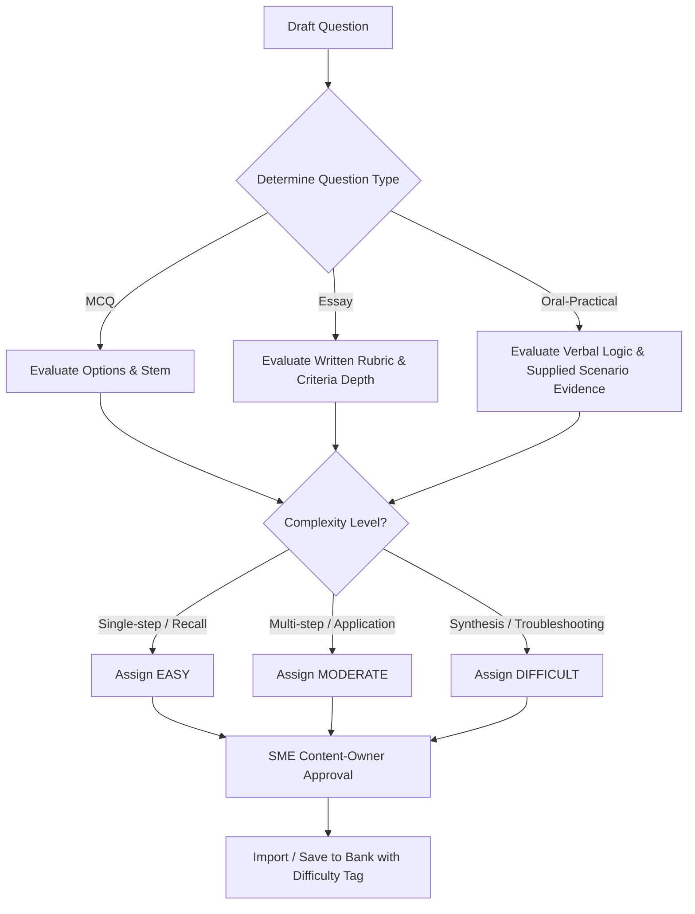

# Question Difficulty Guide: QC Competency Technical Assessment (CTA)

## 1. Overview & Purpose

The **QC Competency Technical Assessment (CTA) Portal** evaluates quality control candidates across multiple technical disciplines (Welding, NDT, Piping, Civil, Coating, Electrical, Instrumentation, Mechanical, Cathodic Protection, etc.). 

This **Question Difficulty Guide** establishes a standardized, objective framework for classifying assessment questions into three distinct difficulty levels:
- **Easy**
- **Moderate**
- **Difficult**

### Core Principles
1. **Internal Design Attribute**: Difficulty is an internal assessment-design attribute used by Admins and Reviewers to build balanced, stratified test sessions. Difficulty brackets are **never** displayed to candidates before, during, or after an assessment.
2. **Fixed Scoring Structure**: Difficulty level **does not** alter point values or create unapproved score multipliers. Points are determined by assessment settings.
3. **Objective Evaluation**: Difficulty is determined by cognitive complexity, required technical synthesis, and problem-solving steps, not by question text length, option length, or complex vocabulary alone.
4. **Discipline Owner Validation**: Every question imported or added to the question bank must be assigned a difficulty bracket approved by a qualified discipline Subject Matter Expert (SME).

### Required Difficulty Distribution

For each question type separately, use this target distribution:

| Question Type | Easy | Moderate | Difficult (Hard) |
| :--- | ---: | ---: | ---: |
| MCQ | 30% | 40% | 30% |
| Essay | 30% | 40% | 30% |
| Oral-Practical | 30% | 40% | 30% |

Apply the distribution independently to MCQs, Essays, and Oral-Practical questions. Do not use the combined total across all types to hide an imbalance in one type. For small batches where exact percentages are impossible, use the nearest whole-number allocation. “Hard” is the user-facing description; store it as `difficult`.

For the full catalog generation, create exactly **160 questions per discipline**: 80 MCQs (24 easy, 32 moderate, 24 difficult), 40 Essays (12 easy, 16 moderate, 12 difficult), and 40 Oral-Practical questions (12 easy, 16 moderate, 12 difficult). Spread these totals across the applicable subject/topic entries in `disciplines-subjects-topics.csv`. The totals apply per discipline, not per catalog row. Include the discipline exemplars within these totals.

---

## 2. Difficulty Classification Matrix

| Dimension | Easy | Moderate | Difficult |
| :--- | :--- | :--- | :--- |
| **Bloom's Taxonomy** | **Remembering / Understanding** | **Applying / Analyzing** | **Evaluating / Synthesizing** |
| **Cognitive Focus** | Direct recall of standard values, definitions, basic terminology, or single-step rules. | Interpretation and application of standards to standard field scenarios, multi-step calculations, procedural essays, or combined oral-practical demonstrations. | Synthesis of conflicting code requirements, complex field troubleshooting, edge-case nonconformance disposition, or advanced oral-practical defect analysis. |
| **Number of Steps** | 1 step (direct retrieval or matching). | 2–3 logical steps (interpret supplied criteria, apply them, and explain the result). | Multi-step evaluation (root cause analysis, trade-off analysis, regulatory conflict resolution). |
| **Code / Standard Reference** | Single explicit code clause or standard definition (e.g., ASME, API, AWS, NACE, NEC, ASTM). | Combining two clauses or interpreting tables/charts under standard conditions. | Cross-referencing multiple codes, specifications, project Quality Plans, and non-standard field conditions. |
| **Question Types Supported** | MCQ, Essay, Oral-Practical | MCQ, Essay, Oral-Practical | MCQ, Essay, Oral-Practical |

---

## 3. Classification Definitions & Criteria

### 3.1 Easy (Direct Recall & Routine Single-Step Verification)
- **Aramco Alignment**: Test direct recall of an approved Saudi Aramco requirement, terminology, document, safety rule, or acceptance criterion whenever one applies.
- **Definition**: Questions testing basic technical literacy, standard terminology, essential variables, elementary safety rules, and direct pass/fail criteria.
- **Essay Characteristics**: Brief listing of basic requirements, single-part responses, or direct identification of inspection tools/documents.
- **Oral-Practical Characteristics**: Direct verbal responses on standard definitions/safety rules, single tool identification, or interpreting a single measurement in a role-play or imaginary scenario.
- **Target Distribution**: 30% Easy for each question type.

### 3.2 Moderate (Application & Multi-Step Field Scenarios)
- **Aramco Alignment**: Apply the relevant Saudi Aramco requirement together with the governing international code, project specification, or approved procedure. State which requirement governs when requirements differ.
- **Definition**: Questions requiring candidates to apply codes, standards, and inspection procedures to typical field quality scenarios.
- **Essay Characteristics**: 
  - Standard procedural essay prompts requiring candidates to describe a step-by-step field inspection workflow.
  - Guided by a structured multi-part rubric (e.g. 4 key inspection stages).
- **Oral-Practical Characteristics**: 
  - Combined verbal explanation and role-play walkthrough of a standard inspection task using an imaginary scenario.
  - Candidate explains the inspection steps, selects or describes the appropriate tool, interprets supplied or hypothetical measurements, evaluates results against code tables, and records findings on an inspection sheet or stated report format.
  - Evaluated on technical communication clarity, selection and explanation of measurement methods, interpretation of supplied readings, and correct application of stated requirements. Physical gauge handling is not required.
- **Target Distribution**: 40% Moderate for each question type (default level for legacy questions).

### 3.3 Difficult (Synthesis, Judgment & Non-Routine Troubleshooting)
- **Aramco Alignment**: Synthesize applicable Saudi Aramco requirements with project quality plans, approved procedures, inspection records, and relevant international codes. Resolve conflicts using the stated contractual hierarchy.
- **Definition**: Questions testing advanced technical judgment, root cause investigation, non-routine flaw disposition, or resolving conflicting technical requirements.
- **Essay Characteristics**: Open-ended nonconformance investigation or failure mode analysis.
- **Oral-Practical Characteristics**: 
  - Complex assessment using a role-play or imaginary multi-defect scenario. The candidate evaluates findings, identifies root causes, verbally defends the disposition under reviewer questioning, and drafts a formal Nonconformance Report (NCR) with corrective action disposition.
- **Target Distribution**: 30% Difficult (Hard) for each question type.

---

## 4. Question Classification Exemplars by Discipline

### 4.1 Welding QC

#### Easy
- **Type**: MCQ
- **Prompt**: Which of the following is considered an essential variable for SMAW procedure qualification under ASME Section IX?
  - A) Change in base metal P-Number *(Correct)*
  - B) Change in brand of welding machine
  - C) Minor decrease in preheat within 10°C
  - D) Change in lighting conditions
- **Classification Justification**: Tests direct recall of ASME Section IX essential variables for SMAW.

#### Moderate (MCQ)
- **Type**: MCQ
- **Prompt**: During visual inspection of a groove weld on a carbon steel pipe (P-No. 1), an inspector notes a 1.5 mm undercut. Per ASME B31.3 for Normal Fluid Service, what is the maximum allowable undercut depth?
  - A) 0.8 mm or 1/32 in
  - B) 1.5 mm or 1/16 in, provided it does not exceed 1 mm for depth > 10 mm
  - C) Lesser of 1 mm or 1/32 in *(Correct)*
  - D) Undercut is never acceptable under any condition
- **Classification Justification**: Requires looking up and applying ASME B31.3 visual acceptance criteria for a specific fluid service classification.

#### Moderate (Essay)
- **Type**: Essay
- **Prompt**: Describe the mandatory inspection steps a Welding QC Inspector must perform before, during, and after a production pipe weld on carbon steel piping. List the key verification records to be signed.
- **Rubric**:
  - Pre-weld checks: WPS/PQR availability, welder qualification (WQR), joint fit-up/bevel, cleanliness, tack weld quality, preheat.
  - In-process checks: Interpass temperature, cleaning between passes, electrode storage/baking, visual appearance of root/hot pass.
  - Post-weld checks: Visual inspection against acceptance criteria, NDT requisition, weld log updates, dimensional check.
  - Records: Weld summary report, NDT reports, joint traceability sign-off.
- **Classification Justification**: Standard procedural application essay following a structured 4-part inspection workflow for routine welding operations.

#### Moderate (Oral-Practical)
- **Type**: Oral-Practical
- **Prompt**: Using the provided Bridge Cam gauge and welded pipe coupon, inspect the weld joint for root/face reinforcement height and undercut. Verbally explain how you verify on-site that the welder's qualification (WQR) covers this joint, log all measurements on the inspection report sheet, and state pass/fail against ASME B31.3.
- **Rubric**:
  - verbal explanation of WQR essential variable verification (P-No, F-No, thickness, position).
  - selecting, zeroing, and correctly measuring reinforcement height with the Bridge Cam gauge.
  - accurate measurement of undercut depth and evaluation against ASME B31.3 limits.
  - completing the inspection log sheet with clear pass/fail determination.
- **Classification Justification**: Combined oral-practical evaluation pairing verbal welder verification logic with hands-on gauge inspection.

#### Difficult (Essay)
- **Type**: Essay
- **Prompt**: Explain the primary causes of hydrogen-induced cracking (cold cracking) in carbon steel weldments. Detail three preventive measures, and outline how a QC Inspector must investigate and disposition a post-hydrotest delay crack detected on a thick-wall P-No. 5B alloy steel joint.
- **Rubric**: 
  - identifying 3 factors: diffusible hydrogen, susceptible microstructure (martensite), residual stress.
  - detailing mitigations: low-H2 consumables, preheat/interpass control, PWHT / de-hydrogenation heat treatment (DHT).
  - root cause & disposition: NDT re-examination, excavation boundaries, repair WPS qualification, hydrogen baking, and engineering evaluation.
- **Classification Justification**: Synthesizes metallurgy, non-destructive testing, repair procedures, and root cause analysis in alloy steel welding.

#### Difficult (Oral-Practical)
- **Type**: Oral-Practical
- **Prompt**: Examine the provided cracked alloy steel weld specimen. Identify the defect type, perform excavation boundary measurements, verbally defend your root cause investigation and repair WPS requirements under reviewer questioning, and complete a formal Nonconformance Report (NCR).
- **Rubric**:
  - physical identification and measurement of defect boundaries.
  - verbal defense of root cause factors (hydrogen, preheat deficiency, martensitic microstructure).
  - proposing compliant repair WPS, preheat/DHT requirements, and re-NDT sequence.
  - drafting a complete, professional Nonconformance Report (NCR).
- **Classification Justification**: Advanced oral-practical synthesis requiring hands-on examination, verbal defense, and formal quality documentation.

---

### 4.2 NDT QC (Non-Destructive Testing)

#### Easy
- **Type**: MCQ
- **Prompt**: In Radiographic Testing (RT), what artifact is placed on the film/detector side or source side to evaluate image quality and radiographic sensitivity?
  - A) Pie Gauge
  - B) IQI / Penetrameter *(Correct)*
  - C) Field Indicator
  - D) Step Wedge Calibrator
- **Classification Justification**: Direct recall of standard NDT terminology and inspection tools.

#### Moderate (MCQ)
- **Type**: MCQ
- **Prompt**: When performing Liquid Penetrant Testing (PT) using solvent-removable lipophilic penetrant, what is the mandatory minimum dwell time for detecting fine fatigue cracks at 20°C ambient temperature per ASME Section V, Article 6?
  - A) 2 minutes
  - B) 5 minutes
  - C) 10 minutes *(Correct)*
  - D) 30 minutes
- **Classification Justification**: Application of ASME Sec V table parameters based on flaw type and surface temperature.

#### Moderate (Essay)
- **Type**: Essay
- **Prompt**: Describe the step-by-step surface preparation, application, dwell time, cleaning, and developer steps required when performing solvent-removable visible dye penetrant testing (PT) on a stainless steel weldment.
- **Rubric**:
  - thorough surface cleaning and drying extending beyond the area of interest.
  - uniform penetrant application and adhering to the minimum dwell time.
  - proper solvent-dampened cloth wipe for excess penetrant removal without over-cleaning.
  - applying a light, uniform coat of developer and observing indications during the development time.
- **Classification Justification**: Standard procedural essay covering standard PT inspection protocol.

#### Moderate (Oral-Practical)
- **Type**: Oral-Practical
- **Prompt**: Perform a magnetic particle inspection (MT) on the provided weld plate using an AC yoke and dry magnetic powder. Verbally explain your yoke calibration check and light level requirements, measure identified indications, and log findings on the MT report.
- **Rubric**:
  - verbal explanation of yoke 10 lb lift test and white light intensity ($\ge 1000\,\text{lux}$).
  - proper yoke placement, magnetic field application, and powder blowing technique.
  - accurate detection and measurement of flaw indications.
  - reporting findings and performing demagnetization/post-cleaning.
- **Classification Justification**: Combined oral-practical evaluation of magnetic particle testing execution and procedural verbalization.

---

#### Difficult (Essay)
- **Type**: Essay
- **Prompt**: A series of radiographs on a critical thick-wall pressure vessel are rejected by the client due to suspected back-scatter and poor image quality. Detail your investigation into the radiographic technique (e.g., shielding, source energy, film type, focal spot size) and explain the corrective actions required to produce acceptable diagnostic radiographs per ASME Section V.
- **Rubric**:
  - identifying back-scatter causes and the use of lead backing screens with a "B" symbol.
  - explaining the selection of appropriate isotope/energy level based on material thickness and density.
  - evaluating geometric unsharpness (Ug) limitations based on focal spot size and source-to-object distance.
  - outlining a revised RT technique sheet and proposing the re-shoot protocol.

#### Difficult (Oral-Practical)
- **Type**: Oral-Practical
- **Prompt**: Review the provided Phase Array Ultrasonic Testing (PAUT) scan images and calibration report for a complex nozzle weld. Verbally defend your interpretation of the flaw characteristics (planar vs. volumetric), explain the impact of mode conversion in this geometry, and propose a supplementary NDT method to confirm the findings.
- **Rubric**:
  - interpreting S-scans and C-scans to accurately identify lack of sidewall fusion versus slag inclusions.
  - explaining the physics of beam steering, focusing, and the risks of mode conversion in complex geometries.
  - proposing supplementary techniques like TOFD or RT to confirm indication sizing and morphology.
  - communicating findings authoritatively and clearly under simulated technical scrutiny.

---

### 4.3 Piping QC

#### Easy
- **Type**: MCQ
- **Prompt**: Per ASME B31.3, what is standard hydrostatic test pressure for metallic piping systems?
  - A) 1.1 times design pressure
  - B) 1.5 times design pressure (adjusted for allowable stress ratio) *(Correct)*
  - C) Equal to operating pressure
  - D) 2.0 times maximum allowable pressure
- **Classification Justification**: Direct recall of standard pressure test formula parameter in ASME B31.3.

#### Moderate (MCQ)
- **Type**: MCQ
- **Prompt**: During a flange alignment inspection, an inspector measures a bolt hole mismatch exceeding 3 mm and flange face parallelism out by 1.5 mm/m. What is the required QC action before torqueing?
  - A) Force alignment using drift pins and tighten bolts
  - B) Reject alignment, issue a nonconformance, and require piping stress re-evaluation or fit-up correction *(Correct)*
  - C) Apply extra gasket sealant to compensate for mismatch
  - D) Heat the pipe spool with a torch to bend it into position without record
- **Classification Justification**: Applied judgment evaluating field tolerance limits against piping code installation requirements.

#### Moderate (Oral-Practical)
- **Type**: Oral-Practical
- **Prompt**: Inspect the provided flange joint spool for gap alignment and face finish. Verbally explain how you verify hydrotest manifold pressure gauges and relief valve calibration, set up a calibrated torque wrench, apply the torque pattern, and complete the flange sign-off sheet.
- **Rubric**:
  - verbal explanation of hydrotest gauge calibration sticker verification and 2x test pressure range check.
  - physical measurement of flange gap parallelism and bolt hole alignment.
  - torque wrench setup, calibration verification, and applying criss-cross torqueing technique.
  - completing the flange inspection report log.
- **Classification Justification**: Integrated oral-practical test combining hydrotest manifold safety verbalization with hands-on flange torqueing.

---

#### Moderate (Essay)
- **Type**: Essay
- **Prompt**: Describe the procedural steps a Piping QC Inspector must take when inspecting a newly fabricated piping spool prior to hydrotesting. Detail the review of isometric drawings, NDT clearance, support installation, and punch list generation.
- **Rubric**:
  - verifying that the spool matches the approved isometric drawing (dimensions, materials, heat numbers).
  - confirming all required NDT is complete, accepted, and documented in the weld tracking system.
  - inspecting the installation of temporary or permanent pipe supports, vents, and drains required for the test.
  - generating a punch list of outstanding items and categorizing them as category A (before test) or B (after test).

#### Difficult (Essay)
- **Type**: Essay
- **Prompt**: During a hydrotest of a high-pressure alloy piping system, the pressure drops by 5% over the 2-hour hold period with no visible leaks on the joints. Explain the potential technical causes, the investigation steps using pressure-temperature charts, and the correct procedural disposition.
- **Rubric**:
  - identifying temperature stabilization effects, entrapped air, or passing isolation valves as potential causes.
  - detailing the process of correlating pressure changes with ambient/fluid temperature variations using pressure-temperature charts.
  - outlining the steps to bleed off air, re-pressurize, and hold, or to install blind flanges if valves are leaking.
  - defining the criteria for a successful test and the documentation required if the test must be aborted and restarted.

#### Difficult (Oral-Practical)
- **Type**: Oral-Practical
- **Prompt**: You are presented with a severely distorted piping spool that cannot be aligned to a rotating equipment nozzle without exceeding API 686 strain limits. Verbally explain the root causes of the fabrication distortion, defend your rejection of the contractor's proposal to use a come-along (chain block) to force alignment, and outline the proper field modification procedure.
- **Rubric**:
  - identifying root causes such as improper welding sequence, lack of strongbacks, or incorrect heat treatment.
  - explaining the detrimental effects of forced alignment (pipe strain) on rotating equipment bearings and mechanical seals.
  - defending the rejection authoritatively against simulated contractor pressure.
  - outlining the correct corrective action (e.g., cutting a field weld, realigning with zero strain, and re-welding).

---

### 4.4 Civil QC

#### Easy
- **Type**: MCQ
- **Prompt**: Before placing concrete in a foundation, what is the primary purpose of a slump test?
  - A) To determine the compressive strength of the concrete
  - B) To measure the workability and consistency of the fresh concrete *(Correct)*
  - C) To check the temperature of the mix
  - D) To determine the aggregate size

#### Moderate (MCQ)
- **Type**: MCQ
- **Prompt**: During a concrete pour, the ambient temperature reaches 35°C (95°F). According to standard hot weather concreting practices (e.g., ACI 305R), what immediate QC action must be enforced?
  - A) Add water to the mix to cool it down
  - B) Stop the pour immediately and wait for nightfall
  - C) Monitor concrete temperature, ensure it does not exceed the specified maximum (e.g., 32°C/90°F), and apply immediate curing measures *(Correct)*
  - D) Increase the vibration time to compensate for rapid setting

#### Moderate (Essay)
- **Type**: Essay
- **Prompt**: Describe the pre-pour inspection requirements for a structural concrete foundation. Detail the checks required for formwork, rebar, embedded items, and site preparation.
- **Rubric**:
  - verifying formwork dimensions, stability, cleanliness, and release agent application.
  - inspecting rebar size, spacing, overlaps, tying, and concrete cover using spacers.
  - confirming the accurate placement and securing of anchor bolts and embedded sleeves.
  - checking the subgrade compaction, vapor barrier condition, and removal of standing water/debris.

#### Moderate (Oral-Practical)
- **Type**: Oral-Practical
- **Prompt**: Using a rebar cover meter (profometer), measure concrete cover depth and rebar spacing on the provided concrete block. Verbally explain the concrete delivery receiving steps and slump rejection rules, and log findings against approved structural drawings.
- **Rubric**:
  - verbal explanation of concrete truck delivery checks (batch ticket, slump, air content, max drop height).
  - cover meter zeroing and calibration check.
  - accurate cover depth and rebar pitch measurement at 3 spots.
  - structural drawing comparison and completing the inspection report.
- **Classification Justification**: Combined oral-practical civil inspection pairing fresh concrete receiving rules with non-destructive cover meter testing.

---

#### Difficult (Essay)
- **Type**: Essay
- **Prompt**: Compressive strength test results for a critical structural column reveal that the 28-day cylinder breaks are 15% below the specified design strength ($f_c'$). Detail the investigation process, the non-destructive field testing methods to assess the in-place concrete, and the steps for engineering evaluation.
- **Rubric**:
  - investigating batch plant records, curing conditions of the cylinders, and testing laboratory procedures.
  - proposing in-place testing such as Schmidt hammer (rebound) surveys or ultrasonic pulse velocity to assess uniformity.
  - outlining the procedure for extracting core samples in accordance with ACI or ASTM standards.
  - explaining the process of submitting data to the structural engineer of record for load-carrying capacity evaluation.

#### Difficult (Oral-Practical)
- **Type**: Oral-Practical
- **Prompt**: Review the provided soil compaction test report showing multiple failures in a deep trench backfill operation. Verbally analyze the contractor's methodology (lift thickness, moisture content, compaction equipment), defend your decision to issue a Stop Work Order, and formulate a corrective action plan.
- **Rubric**:
  - analyzing the report to identify issues like exceeding maximum lift thickness or deviating from Optimum Moisture Content (OMC).
  - explaining the risk of future settlement and pipe stress due to inadequate trench compaction.
  - defending the Stop Work Order firmly and professionally under simulated contractor pushback.
  - formulating a corrective plan requiring excavation, moisture conditioning, controlled lifts, and re-testing.

---

### 4.5 Coating QC

#### Easy
- **Type**: MCQ
- **Prompt**: What is the purpose of an anchor profile (surface roughness) on blasted steel before applying a protective coating?
  - A) To prevent flash rust from forming
  - B) To provide a mechanical "tooth" for the coating to adhere to *(Correct)*
  - C) To make the steel look shiny and clean
  - D) To increase the steel's tensile strength

#### Moderate (MCQ)
- **Type**: MCQ
- **Prompt**: When using a replica tape (Press-O-Film) to measure surface profile, the inspector obtains a reading of 2.8 mils using "X-Coarse" tape and 3.0 mils using "Coarse" tape. What is the correct reported profile?
  - A) 3.0 mils
  - B) 2.8 mils
  - C) 2.9 mils (the average of the two readings) *(Correct)*
  - D) The readings are invalid and the surface must be re-blasted

#### Moderate (Essay)
- **Type**: Essay
- **Prompt**: Describe the inspection sequence for applying a three-coat epoxy/polyurethane system on a newly erected storage tank. Cover surface preparation, environmental monitoring, WFT/DFT checks, and holiday testing.
- **Rubric**:
  - verifying abrasive blasting achieves the specified cleanliness (e.g., Sa 2.5) and anchor profile using replica tape.
  - monitoring ambient conditions (humidity, dew point, steel temperature) before and during application.
  - measuring Wet Film Thickness (WFT) during application and Dry Film Thickness (DFT) per SSPC-PA2 after curing.
  - conducting holiday testing on the final coat (if specified) and documenting results in the coating log.

#### Moderate (Oral-Practical)
- **Type**: Oral-Practical
- **Prompt**: Using a sling psychrometer and surface thermometer, determine ambient dew point and steel surface temperature. Then, use a magnetic Dry Film Thickness (DFT) gauge to perform an SSPC-PA2 DFT survey on the provided coated plate. Verbally explain if coating application can proceed and report DFT compliance.
- **Rubric**:
  - psychrometer operation, dew point calculation, and verifying steel temp $\ge \text{Dew Point} + 3^\circ\text{C}$.
  - magnetic DFT gauge calibration verification using smooth shims on uncoated steel.
  - performing 5-spot SSPC-PA2 DFT measurement (3 readings per spot) and calculating averages.
  - verbal synthesis of environmental compliance and completing the coating inspection sheet.
- **Classification Justification**: Comprehensive coating oral-practical test combining environmental measurement with SSPC-PA2 DFT testing.

---

#### Difficult (Essay)
- **Type**: Essay
- **Prompt**: A newly applied internal tank lining is showing extensive solvent entrapment, blistering, and amine blush. Detail the root cause investigation process, explaining the environmental and application factors that cause these defects, and outline the necessary rework procedure.
- **Rubric**:
  - identifying the causes of solvent entrapment (e.g., over-application, poor ventilation, recoating too soon).
  - explaining amine blush formation due to high humidity and low temperatures during epoxy curing.
  - describing the investigation methods (e.g., solvent rub test, destructive adhesion testing, microscopic examination).
  - outlining the rework procedure requiring complete removal of the defective coating, re-blasting, and re-application under controlled conditions.

#### Difficult (Oral-Practical)
- **Type**: Oral-Practical
- **Prompt**: Review the provided pull-off adhesion test (dolly test) results showing a cohesive failure within the primer coat at a value significantly below the specification. Verbally explain the difference between adhesive and cohesive failure, diagnose the likely application error, and defend your recommendation for coating remediation.
- **Rubric**:
  - correctly defining adhesive failure (between layers/substrate) versus cohesive failure (within a single layer).
  - diagnosing the likely cause of the primer's cohesive failure (e.g., improper mixing, off-ratio components, expired shelf life).
  - defending the remediation plan (removal and re-application) against cost and schedule objections.
  - drafting the technical NCR and clearly documenting the test results and failure mode.

---

### 4.6 Electrical QC

#### Easy
- **Type**: MCQ
- **Prompt**: What is the primary purpose of a Megger (insulation resistance) test on a low-voltage power cable?
  - A) To measure the length of the cable
  - B) To verify the integrity of the cable insulation between conductors and ground *(Correct)*
  - C) To check the voltage drop under load
  - D) To determine the ampacity of the cable

#### Moderate (MCQ)
- **Type**: MCQ
- **Prompt**: During a cable tray inspection, the inspector notes that the fill ratio of power cables exceeds the NEC (National Electrical Code) allowable limit. What is the primary safety consequence of this deviation?
  - A) The cables will become too heavy and break the tray
  - B) Reduced heat dissipation may lead to insulation degradation and potential fire hazards *(Correct)*
  - C) The voltage will drop significantly at the end of the run
  - D) Electromagnetic interference will disrupt power flow

#### Moderate (Essay)
- **Type**: Essay
- **Prompt**: Describe the QC inspection requirements for the installation and termination of a low-voltage motor control center (MCC). Detail the mechanical checks, grounding verification, and pre-energization electrical tests.
- **Rubric**:
  - verifying the physical installation, leveling, anchorage, and clearance distances per the approved drawings.
  - inspecting the main grounding bus connection and individual equipment ground bonding.
  - verifying torque marks on busbar connections and checking cable terminations.
  - detailing pre-energization tests like insulation resistance (Megger), continuity checks, and verifying breaker settings.

#### Moderate (Oral-Practical)
- **Type**: Oral-Practical
- **Prompt**: Inspect the provided 480V motor control panel cable termination. Perform a Megger insulation resistance test on the phase conductors, verbally explain single-line diagram verification and cable glanding rules, and log test results.
- **Rubric**:
  - verbal explanation of single line diagram review, cable tray fill, and glanding requirements.
  - Megger instrument zeroing, lead safety setup, and applying 1000V DC test voltage.
  - accurate insulation resistance reading evaluation against NETA limits ($\ge 100\,\text{M}\Omega$).
  - completing the electrical test report log sheet.
- **Classification Justification**: Combined electrical oral-practical test pairing drawing/gland verbalization with hands-on insulation testing.

---

#### Difficult (Essay)
- **Type**: Essay
- **Prompt**: Following the energization of a large variable frequency drive (VFD) system, severe harmonic distortion and overheating are observed in the supply transformer. Detail the investigation steps a QC inspector must coordinate, the relevant standards (e.g., IEEE 519), and the potential mitigation strategies (e.g., filters, isolation transformers).
- **Rubric**:
  - explaining the generation of harmonics by non-linear loads like VFDs and their effect on transformers.
  - detailing the coordination of power quality measurements using a harmonic analyzer.
  - evaluating the harmonic spectrum against IEEE 519 limits for THD (Total Harmonic Distortion).
  - proposing mitigation solutions such as installing active/passive harmonic filters or line reactors.

#### Difficult (Oral-Practical)
- **Type**: Oral-Practical
- **Prompt**: You discover that a subcontractor has installed unapproved, non-listed electrical fittings in a classified hazardous area (Zone 2). Verbally explain the risks of ignition, defend your decision to issue a major nonconformance and halt commissioning, and explain the required certification documentation (e.g., ATEX/IECEx) needed for the replacement parts.
- **Rubric**:
  - clearly articulating the ignition risks associated with non-certified equipment in explosive atmospheres.
  - defending the stop-work order authoritatively despite project schedule pressures.
  - explaining the specific markings and certificates required for Ex-rated equipment in Zone 2.
  - drafting the formal NCR and outlining the strict rework and re-inspection process.

---

### 4.7 Instrumentation QC

#### Easy
- **Type**: MCQ
- **Prompt**: What is the standard analog signal range used for transmitting process variables (like pressure or temperature) in industrial instrumentation?
  - A) 0 to 10 Volts DC
  - B) 4 to 20 mA DC *(Correct)*
  - C) 1 to 5 Amps AC
  - D) 10 to 50 mV DC

#### Moderate (MCQ)
- **Type**: MCQ
- **Prompt**: When calibrating a differential pressure (DP) transmitter for level measurement in an open tank, the inspector notes the transmitter is installed 2 meters below the bottom tap. What calibration adjustment is necessary?
  - A) None, the installation height does not matter
  - B) A zero suppression adjustment is needed to account for the wet leg *(Correct)*
  - C) A zero elevation adjustment is needed
  - D) The span must be reduced by 50%

#### Moderate (Essay)
- **Type**: Essay
- **Prompt**: Describe the inspection and testing procedure for a newly installed pneumatic control valve prior to loop testing. Cover the physical installation, tubing, stroke testing, and fail-safe action verification.
- **Rubric**:
  - verifying the valve tag, flow direction, and physical installation against P&ID and piping drawings.
  - inspecting the instrument air tubing for correct materials, routing, and leak testing.
  - detailing the stroke test procedure (applying 4, 8, 12, 16, 20 mA) to verify smooth travel and correct positioner feedback.
  - verifying the fail-safe action (Fail Open/Fail Closed) upon loss of instrument air or power.

#### Moderate (Oral-Practical)
- **Type**: Oral-Practical
- **Prompt**: Perform a 5-point calibration check (0%, 25%, 50%, 75%, 100%) on the provided 4–20 mA pressure transmitter using a precision multimeter and pressure hand pump. Verbally explain HART communication setup and failed calibration escalation, and log output readings.
- **Rubric**:
  - verbal explanation of HART communicator configuration, master gauge calibration certificate check, and NCR handling.
  - test pump pressure application and digital multimeter connection.
  - taking accurate mA output readings at 5 calibration points (4, 8, 12, 16, 20 mA).
  - calculating percentage error and logging results on the calibration record sheet.
- **Classification Justification**: Practical instrumentation loop testing combined with verbal calibration governance.

---

---

### 4.8 Mechanical QC

#### Easy
- **Type**: MCQ
- **Prompt**: Which of the following instruments is primarily used to measure the rim and face alignment of a rotating pump-motor skid?
  - A) Ultrasonic thickness gauge
  - B) Dial indicator *(Correct)*
  - C) Holiday detector
  - D) Pit gauge

#### Moderate (MCQ)
- **Type**: MCQ
- **Prompt**: During a soft foot check on a compressor casing, the inspector loosens one hold-down bolt and observes a dial indicator movement of 0.08 mm (0.003 in). Per API 686, what is the required QC action?
  - A) Accept the reading as it is within the 0.05 mm limit
  - B) Reject the alignment as it exceeds the 0.05 mm (0.002 in) limit and require shimming *(Correct)*
  - C) Torque the bolt to twice the required value to force the foot down
  - D) Loosen all other bolts to balance the stress

#### Moderate (Essay)
- **Type**: Essay
- **Prompt**: Describe the procedural steps a Mechanical QC Inspector must follow during the installation and leveling of a static pressure vessel on a concrete foundation. 
- **Rubric**:
  - verifying foundation dimensions, anchor bolt locations, and concrete curing records.
  - inspecting the condition of the vessel baseplate and setting elevation using leveling nuts/shims.
  - using precision levels to verify vertical plumbness and horizontal levelness against project tolerances.
  - documenting the final alignment, torqueing anchor bolts, and releasing for grouting.

#### Moderate (Oral-Practical)
- **Type**: Oral-Practical
- **Prompt**: Using the provided dial indicators and shaft alignment fixture, perform a reverse dial indicator alignment check on the simulated pump-motor skid. Verbally explain soft foot verification and cold-spring checks, and log the rim and face readings against API 686 tolerances.
- **Rubric**:
  - verbal explanation of soft foot checks and pipe strain (cold spring) verification.
  - dial indicator setup, zeroing, and taking accurate 0-90-180-270 degree readings.
  - accurate calculation or plotting of shaft offset and angularity.
  - comparing results against API 686 tolerances and completing the alignment report.

#### Difficult (Essay)
- **Type**: Essay
- **Prompt**: Following the initial alignment of a large centrifugal compressor, the piping subcontractor connects the suction and discharge lines. A subsequent alignment check reveals severe pipe strain exceeding API 686 limits. Detail the root cause investigation steps, the corrective action process to eliminate the cold spring, and the required documentation to close the nonconformance.
- **Rubric**:
  - identifying the root causes of pipe strain (e.g., poor spool fabrication, improper support loading).
  - detailing the process of disconnecting flanges, measuring flange gap/parallelism, and modifying pipe supports or cutting/re-welding spools.
  - verifying that dial indicators on the shaft do not exceed 0.05 mm movement when flanges are torqued.
  - drafting the NCR and maintaining records of the final stress-free alignment.

#### Difficult (Oral-Practical)
- **Type**: Oral-Practical
- **Prompt**: Review the provided pump casing vibration spectrum and maintenance history. Verbally defend your diagnosis of a resonance issue versus unbalance, explain the impact on bearing life, and propose a corrective action plan to the engineering team.
- **Rubric**:
  - analyzing the vibration spectrum to differentiate 1X unbalance from structural resonance frequencies.
  - explaining the mechanical degradation mechanisms on the bearings and mechanical seals.
  - proposing structural stiffening or mass modification to shift the natural frequency.
  - communicating findings clearly and professionally under simulated engineering challenge.

---

### 4.9 Cathodic Protection QC

#### Easy
- **Type**: MCQ
- **Prompt**: Which of the following is commonly used as a reference electrode for measuring pipe-to-soil potentials in impressed current cathodic protection systems?
  - A) Zinc sulfate half-cell
  - B) Copper/copper sulfate (CSE) *(Correct)*
  - C) Aluminum oxide probe
  - D) Carbon steel coupon

#### Moderate (MCQ)
- **Type**: MCQ
- **Prompt**: A cathodic protection survey on a buried pipeline yields an 'instant-off' polarized potential of -870 mV CSE. According to NACE SP0169, does this meet the protection criteria?
  - A) No, it must be more positive than -850 mV
  - B) Yes, it meets the -850 mV polarized potential criterion *(Correct)*
  - C) No, it must exactly equal -850 mV
  - D) Yes, but only if the native potential was -500 mV

#### Moderate (Essay)
- **Type**: Essay
- **Prompt**: Describe the step-by-step procedure for installing and inspecting an impressed current anode bed. Detail the verification of anode materials, cable connections, and coke breeze backfill.
- **Rubric**:
  - verifying anode type, dimensions, and cable resistance prior to installation.
  - inspecting the exothermic welding of the cable to the anode and the encapsulation of the connection.
  - ensuring the proper placement of the anode in the hole and the correct tamping of the coke breeze backfill.
  - documenting the final loop resistance and completing the installation QC log.

#### Moderate (Oral-Practical)
- **Type**: Oral-Practical
- **Prompt**: Using a high-impedance digital multimeter and a copper/copper sulfate reference electrode (CSE), measure the pipe-to-soil potential of the provided test station. Verbally explain the requirement for native vs. polarized potential, and log the readings against NACE SP0169 criteria.
- **Rubric**:
  - verbal explanation of native, 'on', and 'instant-off' potential measurements.
  - multimeter setup, proper lead connections, and placing the CSE in native soil.
  - taking stable and accurate DC voltage readings.
  - evaluating the measurement against the -850 mV criterion and completing the CP survey log.

#### Difficult (Essay)
- **Type**: Essay
- **Prompt**: During commissioning of a new CP system, severe stray current interference is detected on an adjacent third-party pipeline. Explain the mechanisms of stray current corrosion, detail the field testing required to map the interference, and propose three mitigation strategies.
- **Rubric**:
  - explaining the anodic and cathodic zones created by dynamic or static stray currents.
  - detailing the measurement of voltage gradients, potential shifts, and current flow direction using test stations.
  - proposing mitigation methods such as bonding stations, galvanic anodes, or shielding.
  - explaining the coordination and documentation required with the third-party operator.

#### Difficult (Oral-Practical)
- **Type**: Oral-Practical
- **Prompt**: Review the provided CP survey data showing a localized severe potential drop (depolarization) over a 2 km stretch of pipeline. Verbally analyze the potential causes (e.g., coating failure, shorted casing, interference), explain your troubleshooting plan, and draft a formal investigation report.
- **Rubric**:
  - analyzing the data to identify the exact location and magnitude of the anomaly.
  - explaining a logical troubleshooting sequence (e.g., Pearson survey, casing isolation testing, DCVG).
  - verbally defending the selected investigation method against reviewer questions.
  - drafting a comprehensive investigation report with clear actionable recommendations.

---

### 4.10 Telecom QC

#### Easy
- **Type**: MCQ
- **Prompt**: What is the primary purpose of an Optical Time Domain Reflectometer (OTDR) in telecom infrastructure testing?
  - A) To measure the electrical resistance of copper cables
  - B) To measure attenuation, locate faults, and measure splice loss in optical fibers *(Correct)*
  - C) To splice two optical fibers together
  - D) To clean fiber optic connectors

#### Moderate (MCQ)
- **Type**: MCQ
- **Prompt**: When inspecting the installation of a Category 6A UTP cable in a cable tray, the inspector notices the cable bend radius is approximately 2 times the cable diameter. Per standard BICSI/TIA guidelines, what is the required action?
  - A) Accept it, as the minimum bend radius is 1 times the diameter
  - B) Reject it, as the minimum bend radius for Cat 6A is typically 4 times the cable diameter *(Correct)*
  - C) Apply heat to the cable to make the bend permanent
  - D) Ignore it if the cable passes a continuity test

#### Moderate (Essay)
- **Type**: Essay
- **Prompt**: Describe the inspection workflow for a newly installed structured cabling system (copper and fiber). Detail the pre-installation checks, installation monitoring (pulling tension, bend radius), and final testing requirements.
- **Rubric**:
  - verifying approved materials, cable routing plans, and containment systems prior to installation.
  - monitoring cable pulling to ensure maximum tension and minimum bend radius limits are not exceeded.
  - ensuring proper labeling, termination techniques, and separation of services.
  - detailing the final testing requirements (e.g., Fluke testing for copper, OTDR/OLTS for fiber).

#### Moderate (Oral-Practical)
- **Type**: Oral-Practical
- **Prompt**: Inspect the provided fiber optic splice enclosure and patch panel. Perform an OTDR trace on the selected strand, verbally explain bend radius limitations and connector cleaning procedures, and log the attenuation loss against BICSI/TIA standards.
- **Rubric**:
  - verbal explanation of minimum bend radius and proper fiber optic connector cleaning.
  - OTDR setup, launch cable connection, and parameter configuration (wavelength, pulse width).
  - performing the trace and identifying splice/connector loss events.
  - evaluating attenuation against project limits and completing the test report.

#### Difficult (Essay)
- **Type**: Essay
- **Prompt**: A newly installed backbone fiber optic cable consistently fails insertion loss testing on multiple strands, despite passing OTDR testing for splice loss. Detail the root cause investigation steps, focusing on connector contamination, macrobending, and modal dispersion, and formulate a corrective action plan.
- **Rubric**:
  - distinguishing between splice losses (OTDR) and end-to-end insertion losses (OLTS).
  - investigating connector end-face quality using a fiber inspection scope and identifying contamination/scratches.
  - identifying potential macrobending issues in patch panels or routing trays.
  - formulating a systematic cleaning, re-termination, and re-testing plan to resolve the nonconformance.

#### Difficult (Oral-Practical)
- **Type**: Oral-Practical
- **Prompt**: You are presented with a failed Fluke network test report for a complex Cat 6A link showing severe NEXT (Near-End Crosstalk) failure. Verbally analyze the diagnostic graphs, identify the likely physical installation error (e.g., untwisted pairs at the jack, split pairs), and demonstrate the correct re-termination technique while defending your diagnosis.
- **Rubric**:
  - accurately interpreting the NEXT failure graph to locate the fault distance (near end vs. middle of the run).
  - explaining the impact of excessive untwisting or improper jacket removal on crosstalk.
  - demonstrating precision termination techniques to maintain pair geometry.
  - communicating the technical justification clearly and completing the rework documentation.

---

### 4.11 E&I QC

#### Easy
- **Type**: MCQ
- **Prompt**: In hazardous area classification, a "Zone 1" area is defined as a location where an explosive gas atmosphere is:
  - A) Present continuously for long periods
  - B) Likely to occur in normal operation occasionally *(Correct)*
  - C) Not likely to occur in normal operation, and if it does, only for a short period
  - D) Completely safe for hot work at all times

#### Moderate (MCQ)
- **Type**: MCQ
- **Prompt**: During the inspection of an Ex d (flameproof) enclosure, the inspector finds that a standard, non-certified brass cable gland has been installed. What is the required QC action?
  - A) Accept it if it is tightened securely
  - B) Reject the installation; an Ex d certified cable gland must be used to maintain the enclosure's integrity *(Correct)*
  - C) Apply silicon sealant around the threads and accept
  - D) Accept it if the area is reclassified to Zone 2

#### Moderate (Essay)
- **Type**: Essay
- **Prompt**: Describe the inspection requirements for the installation of an explosion-proof (Ex d) electrical panel in a Zone 1 hazardous area. Cover cable glanding, flamepath verification, and grounding checks.
- **Rubric**:
  - verifying the enclosure is certified for the specific gas group and temperature class.
  - inspecting the installation of Ex d certified cable glands, ensuring correct thread engagement and sealing.
  - verifying flamepath gaps are free from scratches, paint, or sealant, and measuring tolerances with feeler gauges.
  - confirming proper internal and external grounding connections.

#### Moderate (Oral-Practical)
- **Type**: Oral-Practical
- **Prompt**: Perform an inspection on the provided explosion-proof (Ex d) junction box and cable gland assembly. Verbally explain the hazardous area classification zone requirements, measure the flamepath gap, and log compliance against IEC 60079 standards.
- **Rubric**:
  - verbal explanation of ATEX/IECEx hazardous area zones and corresponding equipment categories.
  - physical inspection of cable gland type, thread engagement, and sealing compound.
  - using feeler gauges to verify flamepath gaps are within acceptable tolerances.
  - completing the Ex equipment inspection checklist with pass/fail status.

#### Difficult (Essay)
- **Type**: Essay
- **Prompt**: A subcontractor proposes modifying an Ex d flameproof enclosure by drilling a new entry hole for an additional instrument cable. Detail the regulatory and safety implications of this modification under IEC 60079, explain why field modifications void the ATEX/IECEx certification, and outline the proper procedure for adding cable entries to certified equipment.
- **Rubric**:
  - explaining that unauthorized drilling alters the internal volume, pressure containment, and flamepath integrity.
  - detailing how field modifications void the manufacturer's certification and compromise site safety.
  - outlining the correct procedure (e.g., ordering a factory-modified enclosure or using existing spare entries with certified adaptors).
  - drafting a clear technical rejection of the subcontractor's proposal.

#### Difficult (Oral-Practical)
- **Type**: Oral-Practical
- **Prompt**: You discover a complex instrument loop installation where intrinsically safe (Ex i) wiring has been routed in the same cable tray as 480V power cables without separation, and the Ex i barrier is improperly grounded. Verbally explain the severe safety risks, defend your decision to halt commissioning, and outline the comprehensive rework required to restore intrinsic safety.
- **Rubric**:
  - identifying the risk of electromagnetic interference and the potential for a fault transferring lethal energy into the hazardous area.
  - explaining the strict separation requirements for Ex i circuits and the critical role of the dedicated IS ground.
  - defending the stop-work decision authoritatively under simulated pressure from construction management.
  - outlining the complete rework plan (re-routing, re-terminating, grounding) and issuing the NCR.

---

### 4.12 Pipeline QC

#### Easy
- **Type**: MCQ
- **Prompt**: What is the primary purpose of holiday detection (jeeping) on a pipeline coating?
  - A) To measure the thickness of the coating
  - B) To detect pinholes, voids, or flaws in the coating *(Correct)*
  - C) To test the adhesion of the coating to the steel
  - D) To measure the cathodic protection voltage

#### Moderate (MCQ)
- **Type**: MCQ
- **Prompt**: A pipeline inspector is setting the voltage for a holiday detector on a Fusion Bonded Epoxy (FBE) coating that is 400 microns thick. Per NACE SP0490, how is the correct test voltage determined?
  - A) Always use 10,000 Volts regardless of thickness
  - B) Calculate the voltage using the standard formula based on the specific coating thickness (e.g., $V = K \sqrt{T}$) *(Correct)*
  - C) Use the maximum voltage the machine can output to ensure all flaws are found
  - D) Test voltage is determined by the pipeline diameter, not coating thickness

#### Moderate (Essay)
- **Type**: Essay
- **Prompt**: Describe the inspection workflow for a pipeline field joint coating application (e.g., heat shrink sleeve or liquid epoxy). Detail surface preparation, pre-heating, application, and final testing.
- **Rubric**:
  - verifying abrasive blasting achieves the required surface cleanliness (e.g., Sa 2.5) and anchor profile.
  - confirming pre-heating temperatures using contact pyrometers before coating application.
  - monitoring the application process (e.g., sleeve positioning, shrinking sequence to avoid air entrapment).
  - detailing final inspections including visual, DFT measurement, and holiday testing.

#### Moderate (Oral-Practical)
- **Type**: Oral-Practical
- **Prompt**: Inspect the field joint coating application on the provided large-diameter cross-country pipeline segment. Verbally explain the holiday detection (jeeping) calibration process, perform a holiday test using the high-voltage spark tester, and log results against NACE SP0490.
- **Rubric**:
  - verbal explanation of field joint abrasive blasting profile and holiday detector voltage calculation based on coating thickness.
  - holiday detector grounding, voltage setting, and proper travel speed over the coating.
  - accurately identifying and marking any holidays or pinholes.
  - completing the pipeline field joint coating inspection log.

#### Difficult (Essay)
- **Type**: Essay
- **Prompt**: During a cross-country pipeline hydrostatic test, a pressure drop occurs that cannot be attributed to temperature changes. Detail the step-by-step investigation procedure to locate the leak, including sectioning, acoustic monitoring, and dye injection. Explain the quality documentation required once the failure point is excavated.
- **Rubric**:
  - outlining the isolation of pipeline sections to narrow down the leak location.
  - detailing leak detection methods (e.g., acoustic listening devices, dosing with fluorescent dye, or gas tracer methods).
  - explaining the excavation, visual identification of the failure (e.g., weld flaw, material defect), and laboratory analysis requirements.
  - drafting the failure investigation report and the repair/re-test procedure approval process.

#### Difficult (Oral-Practical)
- **Type**: Oral-Practical
- **Prompt**: Review the provided automated ultrasonic testing (AUT) reports for an offshore pipeline laybarge operation showing recurring lack of fusion defects. Verbally analyze the welding parameter trends causing the defects, defend your recommendation to halt the firing line, and draft a corrective action plan to modify the mechanized welding procedure.
- **Rubric**:
  - analyzing AUT flaw locations (e.g., specific clock positions) and correlating them with mechanized welding parameters (e.g., travel speed, torch angle).
  - defending the decision to halt high-speed production welding despite severe operational pressure.
  - proposing specific adjustments to the WPS and requiring re-qualification or supplementary training.
  - drafting a clear, technical NCR and corrective action plan.

---

### 4.13 PQCS (Project Quality Control Supervisor)

#### Easy
- **Type**: MCQ
- **Prompt**: What is the primary role of an Inspection and Test Plan (ITP) in a project quality management system?
  - A) To provide a list of all workers on the site
  - B) To define the sequence of inspections, hold points, and reference standards for a specific work scope *(Correct)*
  - C) To calculate the financial cost of quality failures
  - D) To serve as the daily time sheet for inspectors

#### Moderate (MCQ)
- **Type**: MCQ
- **Prompt**: A subcontractor proceeds with a concrete pour without inviting the client to a designated "Hold Point" on the approved ITP. As the PQCS, what is the appropriate immediate action?
  - A) Issue a nonconformance report (NCR) and halt further work on that structure until the deviation is evaluated *(Correct)*
  - B) Approve the pour retrospectively if the concrete looks acceptable
  - C) Delete the hold point from the ITP to match the field work
  - D) Fine the subcontractor for missing the inspection

#### Moderate (Essay)
- **Type**: Essay
- **Prompt**: Describe the steps a PQCS must take when evaluating a subcontractor's Quality Control Plan (QCP) and Inspection & Test Plan (ITP) prior to project mobilization. Detail the review of personnel qualifications, procedure approvals, and audit scheduling.
- **Rubric**:
  - evaluating the QCP for alignment with the prime contractor's Quality Manual and ISO 9001.
  - reviewing the ITP for correct insertion of company/client Hold, Witness, and Review points.
  - verifying that all subcontractor QC personnel, NDT technicians, and special processes (WPS/PQR) are formally approved.
  - establishing a schedule for internal/external quality audits and management review meetings.

#### Moderate (Oral-Practical)
- **Type**: Oral-Practical
- **Prompt**: Conduct a simulated kick-off meeting with a new civil subcontractor. Verbally explain the project's quality KPIs, the NCR escalation process, and the requirements for closing out punch list items. Respond to a scenario where the subcontractor pushes back on ITP hold point notifications.
- **Rubric**:
  - clearly communicating the project quality objectives, KPI targets (e.g., weld repair rates, NCR closure times), and reporting requirements.
  - explaining the formal NCR process, root cause analysis expectations, and consequences of unauthorized rework.
  - maintaining professional authority and contractual firmness when addressing subcontractor resistance to hold points.
  - documenting the meeting outcomes and action items in a formal minute of meeting.

#### Difficult (Essay)
- **Type**: Essay
- **Prompt**: A major project is experiencing a high rate of recurrent nonconformances across multiple disciplines (civil, welding, and electrical), indicating a systemic failure of the subcontractor's quality management system. Draft a comprehensive Quality Audit Plan and Corrective Action Strategy to investigate the root causes, enforce compliance, and prevent project schedule delays.
- **Rubric**:
  - identifying the systemic nature of the failures and the need for a multidisciplinary quality audit.
  - detailing the audit scope, including document control, training records, inspection execution, and management oversight.
  - formulating a strategy to impose stringent corrective actions, such as removing unqualified personnel or increasing client oversight.
  - structuring the response as a formal executive report to the Project Director.

#### Difficult (Oral-Practical)
- **Type**: Oral-Practical
- **Prompt**: You are presented with conflicting interpretations of a critical project specification regarding PWHT requirements between the client's engineering team and your subcontractor. Verbally facilitate a simulated technical dispute resolution meeting. Defend the contractually correct position using the code hierarchy, negotiate a compliant path forward, and formally document the concession or technical query.
- **Rubric**:
  - accurately interpreting the contract document hierarchy and international code requirements (e.g., ASME B31.3 vs. Project Spec).
  - demonstrating advanced negotiation and facilitation skills to de-escalate tension while maintaining technical integrity.
  - proposing a compliant technical solution (e.g., engineering waiver, revised procedure).
  - drafting a clear, legally and technically sound Technical Query (TQ) or Concession Request.

#### Difficult (Essay)
- **Type**: Essay
- **Prompt**: During a critical loop check, an automated Emergency Shutdown (ESD) valve fails to close within the specified response time (e.g., < 2 seconds). Detail the root cause investigation steps involving the solenoid valve, quick exhaust valve, actuator sizing, and air supply, and explain the reporting process.
- **Rubric**:
  - investigating the solenoid valve (SOV) flow capacity (Cv) and quick exhaust valve operation.
  - assessing potential mechanical binding in the valve stem or actuator spring fatigue.
  - evaluating the instrument air supply volume and tubing size.
  - drafting a comprehensive technical report with root cause findings and corrective actions (e.g., resizing the quick exhaust valve).

#### Difficult (Oral-Practical)
- **Type**: Oral-Practical
- **Prompt**: Review the provided calibration data for a custody transfer orifice flow meter that shows a consistent non-linear error outside acceptable custody transfer limits. Verbally analyze the potential causes (e.g., orifice plate damage, impulse line issues, transmitter non-linearity), defend your rejection of the calibration, and propose a troubleshooting sequence.
- **Rubric**:
  - identifying potential physical issues like a blunt orifice edge, backwards installation, or unequal impulse line legs.
  - analyzing the transmitter calibration data for square root extraction errors or span shifts.
  - defending the rejection of the meter for custody transfer use due to financial impact.
  - proposing a logical troubleshooting sequence starting with physical inspection of the primary element.

---

## 5. Question Type Guidelines

### 5.0 Saudi Aramco alignment requirements

- Identify the applicable current Saudi Aramco reference before drafting the question, such as SAES, SAMSS, SAEP, SATIP, GI, a company specification, or an approved project specification.
- Use an international code only when it is referenced by, delegated through, or clearly applicable alongside the Saudi Aramco requirement.
- Do not claim that a value, tolerance, test method, hold point, or acceptance criterion is an Aramco requirement unless the source has been verified by the discipline SME.
- Record the document identifier and revision or edition in the answer key, reviewer notes, or approved question metadata when the requirement is revision-sensitive.
- If the answer depends on a project-specific deviation, concession, waiver, or approved procedure, state that condition in the question.
- Where Saudi Aramco requirements and an international code differ, state the governing document or contractual hierarchy explicitly. Do not create an ambiguous question based on an unstated precedence rule.
- Questions without verified Saudi Aramco alignment must be marked **Not Approved for Use** and excluded from candidate assessments.

```mermaid
flowchart TD
    A[Draft Question] --> B{Determine Question Type}
    B -->|MCQ| C[Evaluate Options & Stem]
    B -->|Essay| D[Evaluate Written Rubric & Criteria Depth]
    B -->|Oral-Practical| E[Evaluate Verbal Logic & Supplied Scenario Evidence]
    
    C --> F{Complexity Level?}
    D --> F
    E --> F
    
    F -->|Single-step / Recall| G[Assign EASY]
    F -->|Multi-step / Application| H[Assign MODERATE]
    F -->|Synthesis / Troubleshooting| I[Assign DIFFICULT]
    
    G --> J[SME Content-Owner Approval]
    H --> J
    I --> J
    J --> K[Import / Save to Bank with Difficulty Tag]
```

### 5.1 Multiple Choice Questions (MCQs)
- **Exemplar structure**: Use direct technical recall for easy items, a concrete observation or calculation for moderate items, and competing technical evidence or constraints for difficult items. Follow the corrected discipline exemplars. Do not substitute a catalog topic into a generic question about the correct procedure.
- **Complete question data**: Supply all readings, units, dimensions, equipment conditions, acceptance limits, formulas when their recall is not being tested, and applicable contractual precedence needed for a unique answer. Do not refer to a diagram, table, scan, certificate or report that is not supplied. A case-specific limit must be identified as a case or approved-procedure condition, not attributed to an unverified standard.
- **No answer leakage**: Do not name a standard in the stem and then ask the candidate to select that standard. Do not repeat the correct answer's defining wording in the stem. Distractors must require technical discrimination rather than recognition of positive wording.
- **Easy**: Direct question stem; 1 correct answer; 3 distractor options that are clearly distinct but closely matched in length and level of detail.
- **Moderate**: Scenario-based stem; distractor options include common calculation errors or misinterpretations of adjacent code clauses.
- **Difficult**: Multi-variable scenario stem; distractor options reflect subtle real-world trade-offs or closely related code exceptions.
- **Plausible Distractors**: Distractors in MCQs must not be obviously incorrect. They should represent common misconceptions, plausible errors, or adjacent requirements so they appear viable to an under-prepared candidate.
- **Avoid Repeated Answer Patterns**: There must not be a pattern in repeated correct answers across the question bank (e.g., repeatedly using variations of "confirm/verify approved document, revision..." as the correct answer). Correct options must be varied in phrasing, structure, and keyword usage.
- **Option length parity**: Distractors must be approximately the same length as the correct answer. As a generation target, keep each option within about 20% of the correct option's word count where practical. Keep grammar, units, precision, specificity, and visual detail parallel so the correct answer is not revealed by its length or completeness.

Before approval, rewrite any option that is noticeably shorter, longer, more qualified, or more technically specific than the others unless that difference is unavoidable and does not reveal the answer.

### 5.2 Essay Questions
- **Easy**: Single-part recall or brief written definition.
- **Moderate**: Describing a complete, routine inspection workflow (before, during, and after inspection), detailing acceptance criteria lookup, recording inspection evidence, and explaining standard nonconformance escalation steps (guided by a structured 4-part rubric).
- **Difficult**: Non-routine defect troubleshooting, root cause analysis, resolving conflicting specification requirements, or developing an emergency quality mitigation plan.

### 5.3 Oral-Practical Questions
- **Easy**: Combined basic verbal questions (definitions, document titles, safety rules) or one direct measurement or interpretation within a role-play or imaginary scenario.
- **Moderate**: Combined verbal interview and practical inspection role-play. The imaginary scenario supplies the relevant facts or measurements. The candidate demonstrates or describes tool selection, interprets results, evaluates findings against code tables, and records results on an inspection sheet or stated report format.
- **Difficult**: High-complexity role-play or imaginary multi-defect scenario. The candidate evaluates findings, identifies root cause factors, verbally defends technical recommendations under reviewer questioning, and drafts a formal Nonconformance Report (NCR).

Practical questions must use role-play or imaginary scenarios only. **Crucially, do not use the words "imaginary" or "role-play" in the question text itself.** Frame the prompt realistically as a professional field scenario. The prompt must identify the candidate's role, the other roles involved, the situation, the supplied facts or hypothetical measurements, and the expected decision or report. The rubric must assess technical reasoning and decisions, not access to physical equipment or a real field site.

Supply all details needed to answer within the oral prompt or an accompanying included exhibit. Replace requests to physically inspect a specimen, operate equipment, or view an unavailable image with a description of the observations and readings. Ask the candidate to explain the method, evaluate the evidence, and state the decision and report contents aloud. Each essay and oral rubric must name four observable technical criteria; do not award points merely for citing a standard or saying that a document should be checked.

---

## 6. Question Bank Governance & Maintenance

1. **Required Metadata**: Every question stored in `questions` table or imported via `qc-question-template.xlsx` must include the `difficulty` field (`easy`, `moderate`, `difficult`).
2. **Aramco Reference**: Every production question must retain its applicable Saudi Aramco reference, revision or edition where relevant, and SME verification status in the reviewer key or approved question source. Questions without verified alignment must not be used in an assessment.
3. **Default Behavior**: Questions with missing or legacy difficulty settings will default to `moderate` until reviewed by a qualified SME. This default does not confirm Aramco alignment.
4. **Database Constraint**: `questions.difficulty` is enforced by database validation to accept only `'easy'`, `'moderate'`, or `'difficult'`.
5. **Periodic Recalibration**: 
   - Item performance metrics (facility index / pass rate per question) should be reviewed annually.
   - If an "Easy" question has a pass rate below 40%, or a "Difficult" question has a pass rate above 90%, the item must be flagged for SME difficulty re-evaluation.
